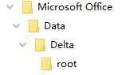
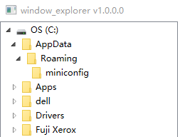

## 问题

最近一个需求，需要在界面中实现Windows资源管理器TreeView的界面。  
但是我发现，我做出的界面和实际系统的界面不太一致，最大的差别是TreeView节点的缩进值。  

- *windows 资源管理器*  



-  wpf 默认实现（修改前）  


- 我们来看下效果（修改后）  


这个缩进会影响整个TreeView在当前的Width下能够打开的层级。

## 解决方案

首先通过修改Style的方式可以更改第一级节点的Indent，但是下一级节点不受影响  
主要影响的Style如下：

```
<ItemsPresenter x:Name="ItemsHost" Grid.ColumnSpan="2" Grid.Column="1" Grid.Row="1" Margin="-12,0,0,0"/>
```

由此为突破口我们定制DateConverter类  

```
using System;
using System.Windows;
using System.Windows.Controls;
using System.Windows.Data;

namespace window_explorer.View
{
    public class TreeViewItemLeftMarginConverter : IValueConverter
    {
        public object Convert(object value, Type targetType, object parameter, System.Globalization.CultureInfo culture)
        {
            var item = (TreeViewItem)value;
            if (item != null)
            {
                var itemshost = (ItemsPresenter)item.Template.FindName("ItemsHost", item);
                if (itemshost != null)
                {
                    Grid.SetColumn(itemshost, 1);
                    Grid.SetRow(itemshost, 1);
                    Grid.SetColumnSpan(itemshost, 2);
                    itemshost.Margin = new Thickness(-12, 0, 0, 0);
                }
            }
            return new Thickness(5, 0, 0, 0);
        }
        public object ConvertBack(object value, Type targetType, object parameter, System.Globalization.CultureInfo culture)
        {
            throw new System.NotImplementedException();
        }
    }
}
```

同时在TreeView的TreeViewItem部分绑定   
Window标签添加 `xmlns:local="clr-namespace:window_explorer.View"`  

```
<Window.Resources>
	<local:TreeViewItemLeftMarginConverter x:Key="LeftMarginConverter"/>
</Window.Resources>
<TreeView x:Name="tree2" SelectedItemChanged="Tree2_SelectedItemChanged" Grid.Column="0" Width="250">
	<TreeView.Resources>
		<Style TargetType="{x:Type TreeViewItem}">
			<Setter Property="HeaderTemplate">
				<Setter.Value>
					<DataTemplate>
						<StackPanel Orientation="Horizontal" Margin="0,2,0,2">
							<Image Name="img"  Width="16" Height="16" Stretch="Fill"
								Source="{Binding RelativeSource={RelativeSource Mode=FindAncestor,
								AncestorType={x:Type TreeViewItem}},
								Path=Header,
								Converter={x:Static local:HeaderToImageConverter.Instance}}"/>
							<TextBlock Text="{Binding}" Margin="{Binding Converter={StaticResource LeftMarginConverter},
								RelativeSource={RelativeSource FindAncestor, AncestorType={x:Type TreeViewItem}}}"/>
						</StackPanel>
					</DataTemplate>
				</Setter.Value>
			</Setter>
		</Style>
	</TreeView.Resources>
</TreeView>
```
